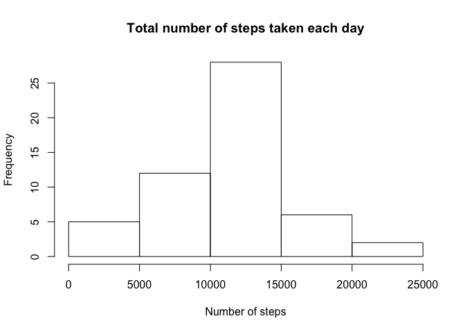
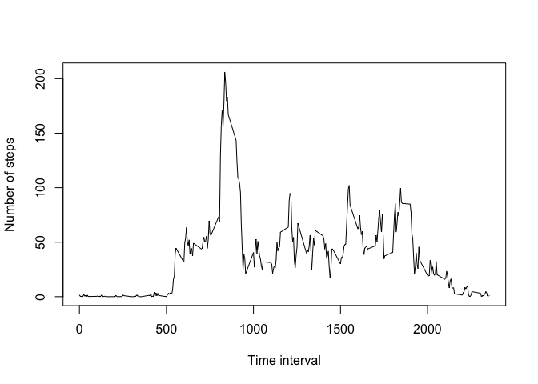
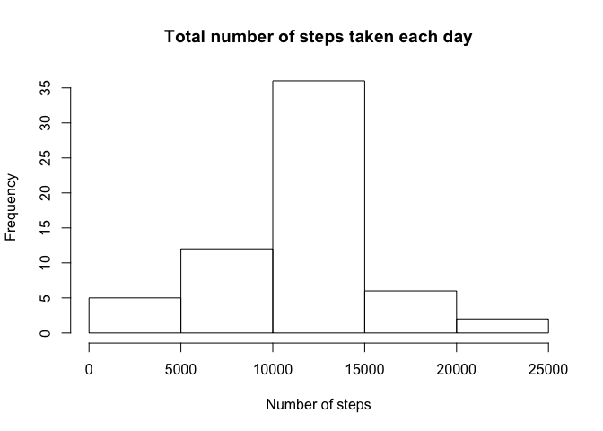
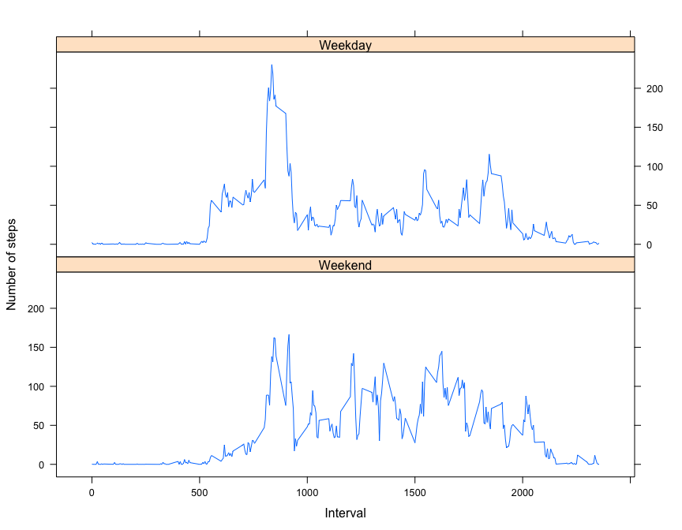

# Reproducable Research - Peer Assignment 1
A. Reijs  
17 Jul 2015  


## Loading and preprocessing the data

Since we've been given a .zip file, lets automate the decompressing part for max reproducability. Afters that we read the data and assign column classes. Lastly we create a couple of columns indicating the weekday and the type of this day (weekday / weekend)

```r
unzip('activity.zip')
activity <- read.csv('activity.csv', colClasses = c("integer", "Date", "integer"))
activity$weekDay <- weekdays(activity$date)
activity$dayType <- factor((activity$weekDay %in% c('Monday', 'Tuesday', 'Wednesday', 'Thursday', 'Friday')), levels=c(FALSE, TRUE), labels=c('Weekend', 'Weekday'))
```

Let's also load dependancies in advance

```r
library(lattice)
```

```
## Warning: package 'lattice' was built under R version 3.1.3
```


## What is mean total number of steps taken per day?
1. Lets calculate the sum of steps per day

```r
sumPerDate <- aggregate(activity$steps, list(Date = activity$date), sum)
```

2. Display a histogram of these steps

```r
hist(sumPerDate$x, xlab = "Number of steps", main = "Total number of steps taken each day")
```

 

3. Finally, the mean of the total number of steps per day is:

```
## [1] 10766.19
```

and the median is:

```
## [1] 10765
```

## What is the average daily activity pattern?
Let's aggregate the number of steps by interval and take the mean of these steps. Also plot the results in a basic chart.


```r
avgPerInterval <- aggregate(activity$steps, list(Interval = activity$interval), mean, na.rm = TRUE)
plot(avgPerInterval$Interval, avgPerInterval$x, type = "l", xlab = "Time interval", ylab = "Number of steps")
```

 

## Imputing missing values


The number of rows containing a missing value is 2304 (13%)

In order to fill the gaps, let's take the average per interval which we've calculated before and apply them to the rows where the number of steps is missing. We can do this by looping over every observation and using the "ifelse" function to get the averaged value or not.

```r
fActivity <- activity

for (i in 1:nrow(fActivity)) {
    fActivity[i, "steps"] <- ifelse(is.na(fActivity[i, "steps"]), avgPerInterval[avgPerInterval$Interval == fActivity[i, "interval"], "x"], fActivity[i, "steps"])
}
```

Let's take a look at a histogram of these new data.


```r
sumPerDateFilled <- aggregate(fActivity$steps, list(Date = fActivity$date), sum)
hist(sumPerDateFilled$x, xlab = "Number of steps", main = "Total number of steps taken each day")
```

 

The new mean of the total number of steps per day is: 

```
## [1] 10766.19
```

and the new median is:

```
## [1] 10766.19
```

Conclusion: after inputting the missing data using average per day and interval, the median has changed to be the same as the mean.


## Are there differences in activity patterns between weekdays and weekends?

In order to check the differences per type of day, lets first make an aggregation of the number of steps per day type and interval. Next we make a plot showing the number of steps per interval grouped by the type of day. As you can tell from the chart, there is a noticable difference.


```r
avgPerDayTypeInterval <- aggregate(fActivity$steps, list(DayType = fActivity$dayType, Interval = fActivity$interval), mean)
xyplot(x ~ Interval | DayType, data = avgPerDayTypeInterval, type = "l", layout = c(1, 2),lab = "Time interval", ylab = "Number of steps")
```

 


